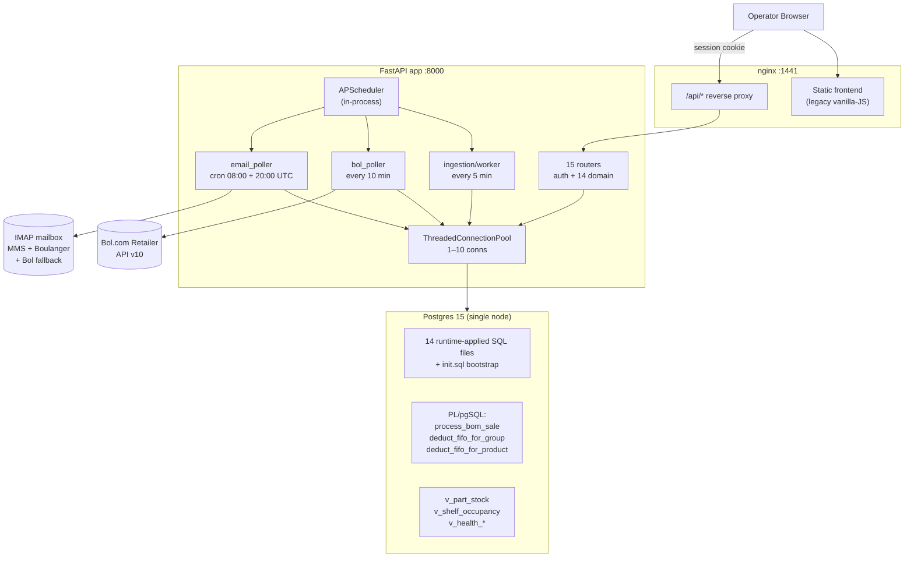
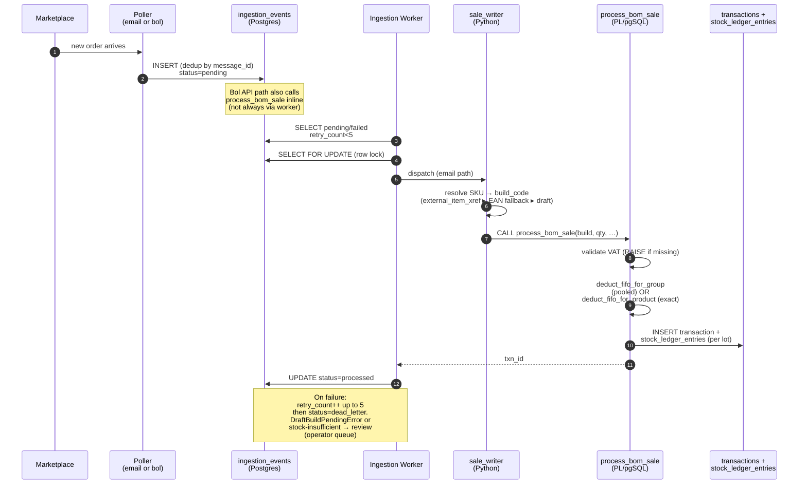
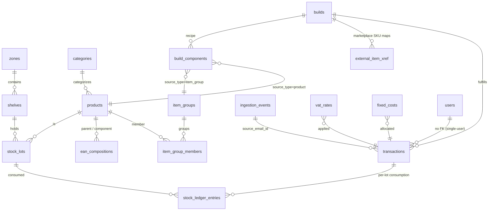
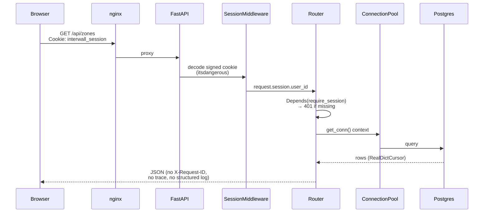
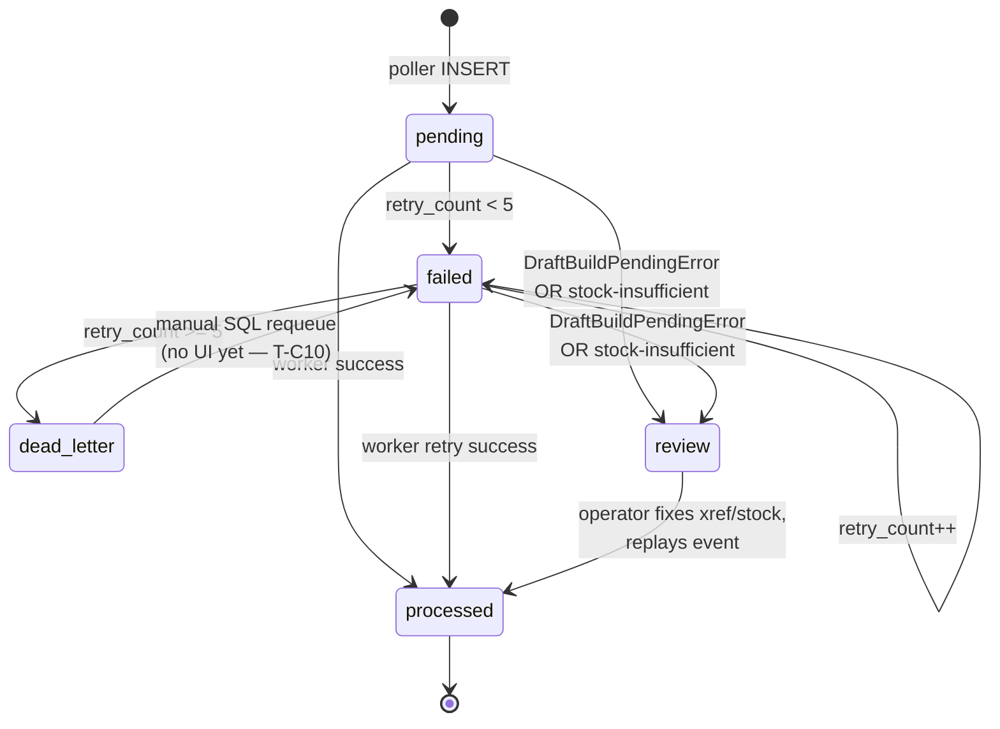

# Interwall — Codebase Analysis & Readiness Assessment

> Reference document. Do not read this first in a cold start.
> Start with `.project/SESSION.md`, `.project/WORKSTREAMS.md`, and `.project/RETRIEVAL.md`.
> Use this file only when the lane summary is not enough and you need deeper architecture or readiness detail.

*Snapshot: 2026-04-16. Branch: `v2`. Synthesis of backend + frontend + `.project/` state.*

---

## TL;DR

- **What it is**: Single-tenant inventory OS for a PC-assembly reseller. Ingests marketplace sales, deducts FIFO components, writes immutable COGS/profit ledger.
- **What works**: Schema + atomic sale engine (`process_bom_sale`) are correct and tested. Backend routers, ingestion workers, dead-letter pipeline are wired. Docker Compose stack is deployable.
- **What's blocked**: `T-D04` — Bol.com API polling is **not yet proven reliable** vs email. Live window shows **49 email-only / 1 API-only / 0 overlap** on a 50-order gate. Release cannot proceed.
- **Two frontends coexist**: legacy vanilla-JS (shipped, served in prod, debt-heavy) and `ui-v2` (React 19 + TS, 4 of 6 views shipped, not yet deployed).
- **Distance**: ~4 weeks to **client-demo-ready**, ~8 weeks to **production-MVP**, ~6+ months to anything resembling **enterprise standard**. The "enterprise" framing is aspirational — the code is a *correct single-tenant system*, not an enterprise platform.

---

## What this product is

- **Users**: one operator (single-user by design, D-003). Hardcoded `admin` bootstrap.
- **Domain**: PC reseller buys components, builds assemblies, sells on three marketplaces (Bol.com, MediaMarktSaturn, Boulanger).
- **Core value**: eliminate margin errors. Every sale deducts from real FIFO lots; COGS and profit are written once at sale time and **immutable** (D-025). No client-side math.
- **Why it matters to the business**: the previous system computed margin in the browser, drifted, and produced wrong profit numbers. This one has a single authoritative ledger.

---

## System architecture

Everything that touches state goes through the same pool. No separate queue service (Redis/RabbitMQ) — `ingestion_events` **is** the queue, stored in Postgres. No external job runner — `APScheduler` runs **inside the API process** (Uvicorn single-process). This works for single-tenant but does not horizontally scale.

---

## Sale ingestion flow

Two paths converge on the same atomic function.

---

## Domain model

Key invariants:
- `stock_lots.quantity >= 0`, `transactions.quantity > 0`, `stock_ledger_entries.qty_delta <> 0` (DB-enforced).
- Every sale has **≥1 ledger row** (D-017, health invariant `/api/health/invariants/sales-without-ledger` must be empty).
- `transactions.cogs` and `transactions.profit` are **write-once**, rejected by `PATCH /api/profit/transactions/{id}` (D-025).
- `build_components.source_type` is XOR over `item_group_id` / `product_id` (DB check constraint).

---

## Authed request path

---

## Ingestion event state machine

Review and dead-letter are **both operator queues with no self-serve UI today**. The Health page surfaces counts but manual retry needs raw SQL.

---

## Module map

### Backend routers (`apps/api/routers/`)

| File | Prefix | Purpose |
|---|---|---|
| `auth.py` (top-level) | `/api/auth` | login/logout/me — session cookie, bcrypt |
| `health.py` | `/api/health` | ping, orphans, invariants, ingestion status |
| `products.py` | `/api/products` | CRUD by EAN |
| `categories.py` | `/api/categories` | tree list, create |
| `compositions.py` | `/api/compositions` | EAN BOM (parent→component), full-replace PUT |
| `item_groups.py` | `/api/item-groups` | AVL pool CRUD + member attach/detach |
| `builds.py` | `/api/builds` | build + components, complete-draft, reset-review |
| `external_xref.py` | `/api/external-xref` | marketplace SKU → build_code mapping |
| `stock_lots.py` | `/api/stock-lots` | lot create, list, history, consume |
| `stock_transfer.py` | `/api/stock` | FIFO-preserving split / relocate |
| `shelves.py` | `/api/shelves` | list, occupancy, patch, delete |
| `zones.py` | `/api/zones` | CRUD + template materialize + shelf create |
| `profit.py` | `/api/profit` | summary, valuation, transactions (immutable) |
| `fixed_costs.py` | `/api/fixed_costs` | margin inputs |
| `vat_rates.py` | `/api/vat_rates` | per-marketplace VAT |

### SQL files (`apps/api/sql/`)

| File | Role |
|---|---|
| `init.sql` | bootstrap schema (runs once via Postgres entrypoint) |
| `02_seed_gs1_products.sql` | GS1 reference seed (runs once via entrypoint) |
| `03_avl_build_schema.sql` | item_groups, builds, build_components, xref, ingestion_events rename |
| `04_shelf_addressing.sql` | bin / split_fifo / single_bin |
| `05_item_groups_backfill.sql` | backfill pre-AVL data |
| `06_backfill_invariants.sql` | invariant repair |
| `07_deduct_fifo_for_group.sql` | pooled FIFO PL/pgSQL (D-020, FOR UPDATE) |
| `08_process_bom_sale.sql` | **atomic sale engine** (D-022) |
| `09_v_part_stock.sql` | canonical part-stock view |
| `10_v_health.sql` | orphans + invariants |
| `11_ingestion_events_dedupe.sql` | message_id uniqueness |
| `12_ingestion_event_attempts.sql` / `12_ingestion_events_retry_count.sql` | retry tracking |
| `13_v_health_ingestion.sql` | ingestion health aggregates |
| `14_v_shelf_occupancy.sql` | wall grid view |

Files 03–14 are **re-applied on every startup** by `db.apply_runtime_sql_files()` — idempotent, but there is **no migration framework**. Risk: concurrent schema changes have no locking.

### Pollers & workers

| Module | Trigger | Role |
|---|---|---|
| `email_poller/poller.py` | cron 08:00 + 20:00 UTC, startup, `/api/poll-now` | IMAP scan, parse, insert `ingestion_events` |
| `email_poller/parsers/{mediamarktsaturn,boulanger,bolcom}.py` | — | marketplace-specific parsers |
| `email_poller/sale_writer.py` | called by worker | SKU→build routing (xref ▸ EAN ▸ draft) |
| `poller/bol_poller.py` | every 10 min + startup | Bol Retailer API v10, OAuth2, inline sale write |
| `ingestion/worker.py` | every 5 min + startup | unified retry/dead-letter loop |

### Frontends

| | Legacy (`inventory-interwall/frontend/`) | `ui-v2` (`inventory-interwall/ui-v2/`) |
|---|---|---|
| Stack | vanilla JS + hash SPA | React 19 + TS + Vite + Tailwind 4 |
| Views shipped | 6/6 (Wall, Catalog, Profit, Health, Builds, History) | 4/6 — Health + History are stubs, Builds is read-mostly |
| Modals | 11 | 1 (BuildWorkspace) |
| Deployed? | **yes** (via nginx volume mount) | **no** (dev-only on :1442) |
| `console.log` count | 396 | 0 |
| Loading / error states | sparse | full |
| Theme | dark only (light broken) | dark + light, persisted |
| E2E | 7 Playwright specs (`inventory-interwall/e2e/`) | 0 |

---

## Gap assessment vs "enterprise standard"

Be honest: *enterprise standard* for this scale is the wrong target. This is a single-tenant ops tool. Below is what would need to change **if** the framing stuck. "Severity" is the gap to the stated framing, not to the actual product.

| Dimension | Present? | Evidence | Severity | Estimate to close |
|---|---|---|---|---|
| Authn / authz | session cookie, bcrypt, single user | `apps/api/auth.py` | — | n/a (by design, D-003) |
| Multi-tenant / RBAC | **no** | no tenant column, no roles | high | 4–6 weeks (schema + guards + UI) |
| Audit log | partial | `transactions` + `ingestion_events` are immutable logs; no change-tracking triggers, no user attribution | medium | 1–2 weeks |
| CI / CD | **no** | no `.github/`, no pipeline, deploy is `deploy-server.sh` | high | 3–5 days for basic GH Actions |
| Observability / metrics | **no** | no `/metrics`, no tracing, no request log middleware | high | 1 week (OTel + Prom exporter) |
| Structured logging | **no** | plain text, `logging.basicConfig` INFO | medium | 1 day (JSON handler + request-id middleware) |
| Alerting | **no** | Health page surfaces data, nothing pages | high | depends on hosting |
| Backups / DR | manual | `scripts/rehearse-backup-restore.sh` + runbook; no scheduler, no off-site | medium | 2–3 days (cron + S3 + retention) |
| Secrets | env vars | `.env.example` has `change-me-in-production`; no vault | medium | 2–3 days (AWS SM / sops) |
| Rate limiting | **no** | no middleware | low (single user) | 1 day |
| CORS | **no** | same-origin deployment | low | n/a |
| Migrations framework | **no** | ordered SQL files, idempotent, no version table, no lock | medium | 1 week (Alembic retrofit) |
| Horizontal scaling | **no** | APScheduler in-process, in-memory sessions | high | 2–3 weeks (Redis sessions + external scheduler) |
| API versioning | **no** | `/api/*` unversioned | low | 1 day (`/api/v1` prefix) |
| Input validation | partial | Pydantic on bodies, inconsistent on query/path | low | 2–3 days |
| Session persistence | **no** | restart logs out all users | low (1 user) | 1 day (DB session store) |
| Frontend build pipeline | partial | `ui-v2` has Vite build; not wired into Compose | medium | 1 day to swap nginx volume |
| E2E in CI | **no** | Playwright exists, not running on PRs | medium | 2 days (GH Actions + ephemeral Postgres) |

**Total** if every gap closed: roughly **12–16 engineering weeks**, not counting the MVP work below.

---

## Distance to MVP (stated scope)

Pulled from `.project/TODO.md` and `.project/COACH-HANDOFF.md`. Status is *as of the current branch on 2026-04-16*.

### Backend (Stream D)
- **T-D01 / D02 / D03** — pytest harness, production secrets hardening, deploy/backup runbook → **DONE**
- **T-D04** — live Bol overlap proof → **BLOCKED**. 50-order window: 49 email-only, 1 API-only, 0 overlap. Real blocker is **73 unresolved `OMX-BOL-*` SKU rows** + **28 real stock shortages**. Needs either better description-normalization, SKU-mapping backfill, or accepting email as the primary source.
- **T-D05** — sale routing audit → **DONE** (`process_bom_sale` is the only live path; `process_sale` is SQL-migration-only).
- **T-D06** — 30-day production soak → **TODO**, calendar-gated behind D04.

**Backend unblocks in 1–3 weeks of focused work, plus 30 days of soak once D04 is green.**

### Frontend (Stream C)
Two tracks are running in parallel — `.project/TODO.md` tracks hardening of the **legacy** frontend (T-C03 through T-C11); `inventory-interwall/ui-v2/docs/HANDOFF.md` tracks the **rewrite**. These are not the same workstream.

Legacy hardening open: C03 (wall grid from DB), C04/C05 (wall picker UX), C06 (batches), C07 (product wizard), C08 (builds editor), C09 (purchases feed), C10 (health + dead-letter retry), C11 (hardcoded values + sanitize audit). Realistic: **3–4 weeks** to finish if all go into legacy.

`ui-v2` open: Health port, History port, Builds create/edit flow, E2E port. Realistic: **2–3 weeks** to feature parity.

**Picking one track matters — doing both is 6+ weeks; doing just one is 3.**

### Data / operations
- **300+ events in review / dead-letter**: 73 BolCom review, 245 MMS review (197 stock shortage + 48 draft xref), 90 Boulanger dead-letter. Each needs operator triage. Without a retry UI (T-C10), this is SQL work.
- No operator has been onboarded to the runbook yet.

### MVP total estimate
**5–8 weeks** from today:
- 1–3 weeks: close T-D04 (Bol routing fix or accept email-primary)
- 2–3 weeks: finish ui-v2 Health + History + Builds editor (recommended) OR finish legacy C03–C11
- 3–5 days: wire dead-letter retry endpoint + UI
- 30 days calendar: T-D06 soak (parallel with the above)

---

## Distance to client-consumable

Narrower bar than MVP: can a non-you operator use it without needing you?

**Currently missing for client-consumable**:
1. **Dead-letter and review triage UI** — today the operator needs SQL to requeue. (T-C10, 3–5 days.)
2. **Build create / edit** — `ui-v2` read-only; legacy works but is modal-heavy. (T-C08, 4–6 days.)
3. **Health visibility** — legacy has it (ugly); `ui-v2` is a stub. (2–3 days.)
4. **Clear "setup day" path** — first zone, first shelves, first products, first builds, first xref. There is no wizard tying these together. (T-C07, 3–4 days.)
5. **Ops docs the operator can follow** — `.project/BACKEND-DEPLOY-RUNBOOK.md` exists; no equivalent operator playbook for day-to-day exceptions. (1–2 days of writing.)

**Client-demo-ready estimate: ~4 weeks of focused frontend work** (on `ui-v2` only), assuming the Bol ingestion question is either resolved or scoped out for demo purposes.

---

## Recommended cutline

Three honest tiers:

### 4-week "client demo" (no soak)
- Stop frontend split. Finish `ui-v2` Health + History + Builds editor + dead-letter retry UI. Ship behind nginx. Retire legacy once `ui-v2` hits parity.
- Accept email as primary Bol source; park API polling as "future reliability work". Document the decision.
- Operator playbook: one page, top 5 failure modes + recovery steps.
- **Explicitly deferred**: CI, multi-user, audit log, metrics, horizontal scaling, migrations framework.

### 8-week "production MVP" (adds soak + hardening)
- Everything above, plus:
- T-D06 30-day soak on real traffic (parallel).
- Basic GitHub Actions CI (tests + build + Playwright smoke on PRs). 3–5 days.
- JSON structured logging + request-id middleware. 1 day.
- Scheduled backups with retention + off-site copy. 2–3 days.
- Alembic retrofit over the existing SQL files. 1 week.

### 6-month "enterprise" (frame shift)
Only pursue if the product is being sold to multiple customers or needs compliance:
- Multi-tenant schema migration (tenant_id everywhere). 4–6 weeks.
- RBAC + user management UI. 2 weeks.
- Prometheus + OTel traces + alerting. 1–2 weeks.
- External scheduler (Celery or Temporal) — decouple pollers from the API process. 2–3 weeks.
- Redis sessions; two API replicas behind nginx. 1 week.
- SOC-style audit log with triggers + user attribution. 2 weeks.
- Disaster recovery: streaming replica, documented RTO/RPO. 2 weeks.

**My read**: the 4-week path is the right call. The system is **correct**, not enterprise. Finish the frontend, close the Bol question honestly, and ship to the operator. Re-frame later only if real multi-customer demand shows up.

---

*Files referenced for this report: `apps/api/main.py`, `apps/api/db.py`, `apps/api/sql/07_deduct_fifo_for_group.sql`, `apps/api/sql/08_process_bom_sale.sql`, `apps/api/ingestion/worker.py`, `apps/api/email_poller/sale_writer.py`, `apps/api/poller/bol_poller.py`, `.project/TODO.md`, `.project/COACH-HANDOFF.md`, `.project/T-D04-BOL-OVERLAP-REPORT.md`, `.project/T-D05-SALE-ROUTING-AUDIT.md`, `inventory-interwall/ui-v2/docs/HANDOFF.md`, `inventory-interwall/ui-v2/docs/backend-asks/*.md`.*
